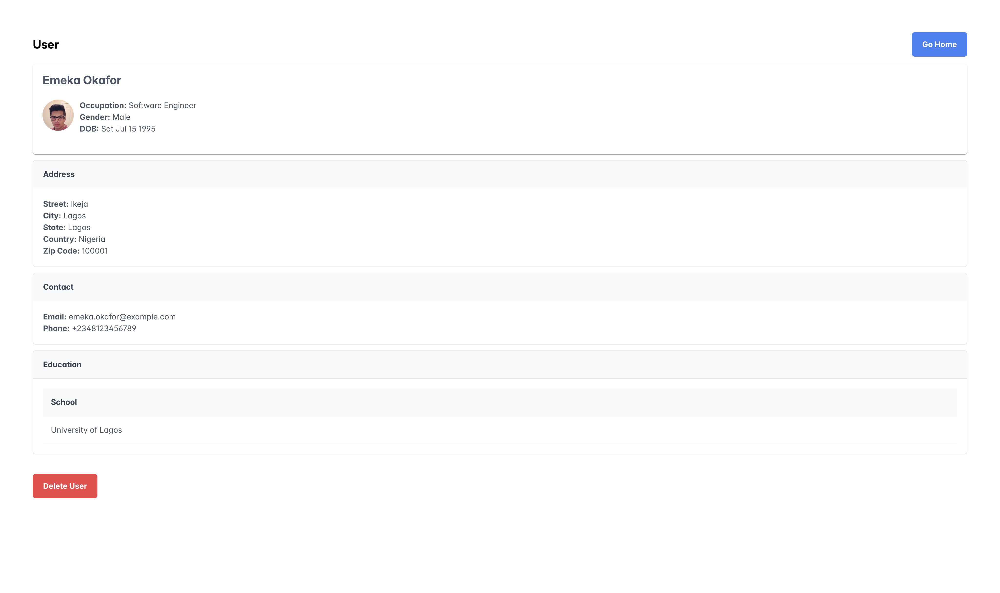

# **Full Stack Developer Technical Test**

This is a technical test project that implements a **CRUD application** for managing user records. The project consists of a **NestJS backend** and a **React frontend**, using **PostgreSQL** as the database.

---

## **📂 Project Structure**

- **Backend:** Built with **NestJS**, **TypeScript**, and **PostgreSQL** using **Prisma ORM** for database management.
- **Frontend:** Built with **React (Vite)**, **Redux Toolkit**, **React Hook Form**, and **Tailwind CSS**, utilizing **PrimeReact** for UI components.

---

## **🚀 Features**

### **Backend (NestJS)**

- **User CRUD API** with endpoints to create, update, delete, and fetch user records.
- Stores user data across **four database tables**:
  - **UserInfoTB** (Profile Photo, First Name, Last Name, DOB, Occupation, Gender)
  - **UserContactTB** (Email, Phone Number, LinkedIn URL, Fax)
  - **UserAddressTB** (Address, City, State, Country, Zip Code)
  - **UserAcademicsTB** (List of past schools)
- **Validation** for request data using DTOs and class-validator.
- **Single API request** handles saving all user-related data into respective tables.
- **Prisma ORM** for database interactions.
- **Docker support** for easy database setup.

### **Frontend (React + Vite)**

- **Multi-step form wizard** using **React Hook Form** to collect user details.
- **Resume-like preview** in the final step to display entered data.
- **User management** panel to:
  - View all users.
  - View individual user details in a resume-like format.
  - Update user information.
  - Delete users.
- **Redux Toolkit** for global state management.
- **PrimeReact** for enhanced UI components.

---

## **🛠 Setup Instructions**

### **Backend Setup**

1. Navigate to the backend directory:
   ```sh
   cd backend
   ```
2. Install dependencies:
   ```sh
   npm install
   ```
3. Start the database using Docker:
   ```sh
   docker compose up -d
   ```
4. Copy `.env.example` and rename it to `.env`:
   ```sh
   cp .env.example .env
   ```
5. Run database migrations:
   ```sh
   npx prisma migrate dev
   npx prisma migrate deploy
   ```
6. Seed the database (optional):
   ```sh
   npx prisma db seed
   ```
7. Start the backend server:
   ```sh
   npm run start
   ```
8. API will be available at:
   ```
   http://localhost:3000/api/user
   ```
   - **GET** `/api/user` → Fetch all users
   - **POST** `/api/user` → Create a new user
   - **PATCH** `/api/user/:id` → Update a user
   - **DELETE** `/api/user/:id` → Delete a user
   - **GET** `/api/user/:id` → Fetch a single user

---

### **Frontend Setup**

1. Navigate to the frontend directory:
   ```sh
   cd frontend
   ```
2. Install dependencies:
   ```sh
   npm install
   ```
3. Copy `.env.example` and rename it to `.env`:
   ```sh
   cp .env.example .env
   ```
4. Start the frontend development server:
   ```sh
   npm run dev
   ```
5. Open your browser and go to:
   ```
   http://localhost:5173
   ```

---

## **📌 Usage**

- Navigate to the **web client** to manage user records.
- View, create, update, and delete users using the UI.
- The **multi-step form wizard** guides users through input collection.
- The final step provides a **resume-like preview** before submission.

---

## **📸 Screenshots**

**User Management Panel:**
  
**Multi-step Form Wizard:**
  
**Resume-like Preview:**
  

---
